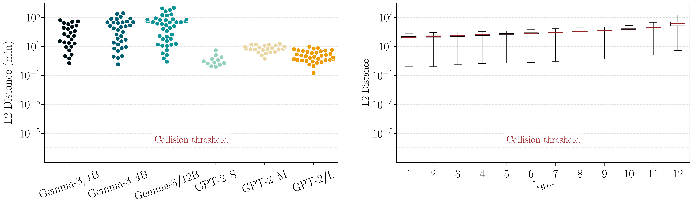

<div align="center">

# Language Models are Injective and Hence Invertible

### Official code for **S**equential **I**nverse **P**rompt via **IT**erative updates (**SIPIT**) - the first algorithm that provably and efficiently recovers the exact input text from a model's hidden states.

[](https://arxiv.org/abs/2510.15511)
[](https://iclr.cc/)
[](https://github.com/giorgosnikolaou/SIPIT)
[](https://github.com/giorgosnikolaou/SIPIT)
[](https://www.python.org/)
[](https://pytorch.org/)
[](LICENSE)

</div>

---

Transformer language models mapping discrete input sequences to continuous hidden representations are **almost-surely injective**, different prompts yield different hidden states for essentially all parameter settings. SIPIT operationalizes this: it reconstructs the **exact** input tokens from intermediate activations via alternating continuous gradient descent and discrete vocabulary projection, with provable **linear-time** guarantees.

This repository also includes two baseline methods; **BruteForce** (exhaustive vocabulary search) and **HardPrompts** (joint sequence optimization).

<p align="center">
  &nbsp;&nbsp;&nbsp;&nbsp;&nbsp;&nbsp;&nbsp;&nbsp;
  <br>
  <sub>Real-analytic structure ensures collisions are measure-zero events (left); empirical collision tests on six models confirm no collisions occur in practice (right).</sub>
</p>

## Setup

Requires Python 3.10+ and CUDA.

```bash
git clone https://github.com/giorgosnikolaou/SIPIT.git
cd SIPIT
pip install -e .
```

For gated models (e.g. Llama, Mistral), copy the example env file and add your HuggingFace token:

```bash
cp .env.example .env
# Edit .env and set HF_TOKEN=hf_...
```

## Usage

### Invert a single prompt

```bash
sipit \
    --command invert-single \
    --method SIPIT \
    --model-id "openai-community/gpt2" \
    --layer-idx -1 \
    --step-size 1.0 \
    --prompt "SIPIT should be able to invert this prompt!"
```

### Invert a dataset

First, create a dataset, then run inversion on it:

```bash
# Create a dataset from real text sources
# --dataset-config points to a JSON file defining the sources to sample from.
# The default config (src/data/datasets.json) includes Wikipedia, C4, ArXiv, and GitHub Python code.
sipit \
    --command create-dataset-collection \
    --dataset-config src/data/datasets.json \
    --dataset-name SIPIT-Collection \
    --tokens 10

# Or create a random token dataset
sipit \
    --command create-dataset-random \
    --dataset-name SIPIT-Random \
    --prompts 100 \
    --tokens 20

# Run inversion
sipit \
    --command invert-dataset \
    --method SIPIT \
    -i data/SIPIT-Collection/gpt2 \
    -o results.csv \
    --model-id "openai-community/gpt2"
```

### Key options

| Flag | Description | Default |
|------|-------------|---------|
| `--method` | `SIPIT`, `BruteForce`, or `HardPrompts` | `SIPIT` |
| `--model-id` | HuggingFace model identifier | `openai-community/gpt2` |
| `--layer-idx` | Layer to invert (`-1` = last) | `-1` |
| `--precision` | Weight precision: `4`, `8`, `16`, or `32` bit | `32` |
| `--step-size` | Step Size | `1.0` |
| `--special-start-token` | BOS token ID (needed for e.g. Llama-3.1) | `None` |

See `scripts/` for more complete examples.

## Testing

Install test dependencies and run the suite with pytest:

```bash
pip install -e ".[test]"
pytest
```

Tests use GPT-2 and cover exact inversion (SIPIT, BruteForce), algorithm completion (HardPrompts), dataset creation, and end-to-end dataset inversion. Add new test files to the `tests/` directory.

## Citation

```bibtex
@article{
    nikolaou2025injective,
    title={Language Models are Injective and Hence Invertible},
    author={Nikolaou*, Giorgos and Mencattini*, Tommaso and Crisostomi, Donato and Santilli, Andrea and Panagakis, Yannis and Rodol{\`a}, Emanuele},
    journal={The Fourteenth International Conference on Learning Representations (ICLR 2026)},
    year={2026},
    url = {https://arxiv.org/abs/2510.15511}
}
```